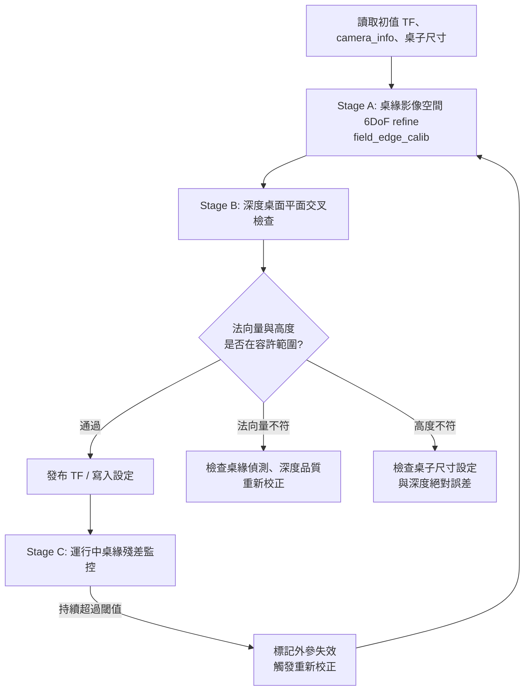

# 相機外參校正（Camera Extrinsic Calibration）

本文件說明本專案中，桌上方 RealSense D455 相機相對場地（`map`）的外參校正流程，以及運行中如何偵測外參失效。

場地與安裝條件：

- 桌面（場地）尺寸：60 × 180 cm
- 相機高度：高於桌面約 130 cm，整張桌面位於視野內
- 相機由 ROS 節點管理，校正程式透過 ROS topic 與 TF 取得資料
- 設計目標：客戶端只需安裝支架並啟動校正，不需擺放任何標定 tag

---

## 1. 策略與分工

| 項目 | 角色 | 實作狀態 | 說明 |
|---|---|---|---|
| 桌緣影像空間 6DoF refine | **主要校正** | 已有（`field_edge_calib`） | 以既有 TF 為初值，直接在影像空間最佳化完整外參 |
| 深度桌面平面 | **交叉檢查** | 待實作 | 檢查 roll / pitch 與高度 h；抓出桌子尺寸設定錯誤等桌緣本身看不出的問題 |
| 桌緣殘差監控 | **運行中失效偵測** | 搬進 ROS 後實作 | 持續計算目前 TF 下的桌緣殘差，相機被碰到時殘差會跳升 |
| IMU 重力 | **不使用** | — | 理由見附錄 A |

原則：`map` 的 z 軸是**桌面法向量**，不是重力方向。所有傾角的參考都是桌面本身。

---

## 2. 誤差敏感度

### 2.1 角度誤差

相機高度 h、觀察桌面上水平距離 d 的點時，傾角誤差 δθ（rad）造成的徑向地面誤差：

```
δx ≈ (h² + d²) / h · δθ
```

本場地以 h ≈ 1.3 m、最遠點 d ≈ 1.1 m 估算：

| δθ | 0.1° | 0.3° | 0.5° |
|---|---|---|---|
| 最遠點誤差 | ≈ 4 mm | ≈ 1.2 cm | ≈ 2 cm |

### 2.2 尺度誤差（桌子尺寸 / 高度）

桌緣校正的尺度由「輸入的桌子尺寸」決定。尺寸設定錯 1%，解出的高度 h 也會錯約 1%，桌緣殘差卻看不出來，因為整個解只是等比例縮放。對應的位置誤差約為：

```
δxy ≈ (δs / s) · 水平距離
```

尺寸錯 1% 時，最遠點約差 1 cm。這是需要深度交叉檢查的主要原因（Stage B）。

---

## 3. 座標系

- **`map`**：原點位於桌面一角（依既有約定），x、y 沿桌邊，z 沿桌面法向量向上。桌面為 z = 0。
- **color optical frame**：桌緣偵測與外參輸出所用的相機座標系（X 右、Y 下、Z 前）。
- **depth optical frame**：深度影像所在座標系，與 color 不同，需用 `extrinsics/depth_to_color` 轉換。

輸出外參為 `map → color optical frame` 的 TF。

---

## 4. 前提

1. 相機由 ROS 節點佔用，校正程式**不能**直接開啟 pyrealsense pipeline，一律從 topic 取資料。
2. 內參從 `camera_info` 讀取（color 與 depth 各自的 `camera_info`）。
3. 既有 TF（來自支架標稱位姿或上次校正）作為最佳化初值。
4. 執行環境沒有 scipy，最佳化使用自寫的 Levenberg–Marquardt（LM）。
5. 校正期間相機靜止。桌上可以有機器人，但會遮擋部分桌緣與桌面，需以 robust 方法處理。

---

## 5. 流程總覽



---

## 6. Stage A：桌緣影像空間 6DoF refine（`field_edge_calib`）

本 stage 對應既有的 `field_edge_calib`。原文件中「先在桌面上做 2D 對齊求初值」的步驟在本專案不需要，因為已有 TF 初值。

**概念**：

1. 影像去畸變，擷取桌面上緣的 edge pixels。
2. 用目前的外參估計，把已知尺寸的桌面長方形投影回影像。
3. 殘差為 edge pixel 到投影邊的**影像空間** point-to-line 距離（量測雜訊發生在 pixel 上，影像空間最符合雜訊模型）。
4. 以 robust loss（Huber / Cauchy）降低誤抓線條與遮擋的影響。
5. 以自寫 LM 對 6DoF 最佳化，旋轉建議用 so(3) 增量參數化。

**注意事項**：

- 只取桌面**上緣**，避免誤抓桌子側面或下緣；桌面厚度會造成系統性偏差。
- 可見桌緣需包含**不平行**的邊。只剩兩條平行邊時問題退化，應判定失敗而非輸出結果。
- 桌緣殘差對**尺度錯誤不敏感**（見 2.2），這部分交給 Stage B 檢查。

---

## 7. Stage B：深度桌面平面交叉檢查

### 7.1 輸入

| 資料 | 來源 |
|---|---|
| 深度影像 | `depth/image_rect_raw` |
| 深度內參 | depth 的 `camera_info` |
| depth → color 外參 | `extrinsics/depth_to_color` |
| 待檢查的外參 | Stage A 的結果 |

深度影像通常為 16UC1，單位以相機的 depth scale 為準（D455 預設為 mm）。

### 7.2 步驟

1. 以深度內參把深度影像反投影成點雲（depth optical frame）。
2. 用 `depth_to_color` 轉到 color optical frame，再用 Stage A 的外參轉到 `map`。
3. **只保留桌面內部的點**：落在桌面長方形內、並往內縮一段邊界（例如 5 cm），避免桌緣附近的深度邊界效應。
4. 以 RANSAC 擬合平面，再用內點做最小平方 refine。機器人與手等物體會被當作離群點排除。
5. 累積數幀（例如 10–30 幀）平均，降低隨機雜訊。

### 7.3 檢查項目

在 `map` 座標系下，若外參正確，擬合出的平面應為 z = 0。

| 檢查 | 計算 | 意義 | 可信度 |
|---|---|---|---|
| 法向量夾角 | 平面法向量與 `map` z 軸的夾角 | roll / pitch 是否正確 | **較高**：深度的尺度偏差不會改變平面方向 |
| 平面偏移 | 平面到 `map` 原點（z = 0）的距離 | 高度 h 是否正確，間接檢查桌子尺寸設定 | **cm 級**：D455 深度有約 1–2% 的尺度偏差，h ≈ 1.3 m 時約 1.3–2.6 cm |
| 平面擬合 RMS | 內點到平面的距離 RMS | 深度本身的健康度（平面彎曲、雜訊） | 用來判斷前兩項能不能信 |

### 7.4 結果判讀

| 結果 | 可能原因 | 處理 |
|---|---|---|
| 全部通過 | — | 發布外參 |
| 法向量夾角過大 | 桌緣誤抓、可見邊不足導致解不穩 | 檢查桌緣偵測結果，重新校正 |
| 平面偏移過大 | 桌子尺寸設定錯誤、深度絕對誤差 | 先確認尺寸設定，再檢查深度 |
| 平面 RMS 過大 | 深度標定不佳、桌面反光或深色 | 此次檢查結果不採信，改用人工驗證 |

### 7.5 限制與改善

- 以 1–2% 的深度尺度偏差來看，高度檢查**只能抓出約 2% 以上的尺寸錯誤**（例如輸入錯規格），抓不到 1% 等級的小誤差。
- 對深度跑 Intel 的 **tare calibration** 可修正絕對距離偏差，縮小高度檢查的容許範圍。
- 深度平面若出現明顯彎曲（RMS 偏大），可跑 **on-chip calibration** 改善平面度。
- 若需要更嚴格的尺度檢查，可在機器人上貼一個**已知實際尺寸**的 tag，用偵測到的 tag 尺寸反推尺度，與桌緣結果比對。

---

## 8. Stage C：運行中桌緣殘差監控（ROS）

相機被碰到、支桿晃動或桌子被推動時，外參會失效。本專案不用 IMU，改以桌緣殘差偵測。

### 8.1 做法

1. 定期（例如每秒一次）以**目前的 TF** 把桌面長方形投影到影像，計算桌緣殘差。
2. 使用 robust 統計量，而不是平均值：
   - 殘差中位數（或截尾平均）
   - 內點比例（殘差小於某個 pixel 閾值的 edge pixel 比例）
3. **遮擋處理**：機器人、手、物品會遮住部分桌緣。每條邊的可見 edge pixel 數量不足時，該邊不參與判斷；可判斷的邊太少時，該次結果標記為「無法判斷」，不視為失效。
4. **遲滯（hysteresis）**：殘差持續超過閾值一段時間（例如 3–5 秒）才判定失效，避免短暫遮擋造成誤報。

### 8.2 判定後的處理

- 發布「外參失效」狀態，下游定位節點應降級或暫停輸出。
- 在機器人靜止時自動重跑 Stage A–B。
- 自動校正失敗才提示使用者。

（選用）Stage B 的深度平面檢查計算量不大，也可以低頻率週期性執行，作為第二道檢查。

---

## 9. 驗收與驗證

### 9.1 每次校正後自動驗收

- Stage A：LM 收斂、桌緣重投影 RMS（pixel）、可見邊數量且包含不平行邊
- Stage A：結果與初值 TF 的差異在合理範圍內（差太多通常代表誤抓）
- Stage B：法向量夾角、平面偏移、平面擬合 RMS

### 9.2 端到端驗證（開發 / 出廠階段）

在桌面上多個已知位置放置機器人或 tag，比較估計位置與真值，特別關注**離相機最遠的區域**。

---

## 10. 參數表（建議初始值，需依實測調整）

| 參數 | 建議初始值 | 說明 |
|---|---|---|
| 桌緣重投影 RMS 上限 | 1–2 px | Stage A 驗收 |
| 法向量夾角上限 | 0.3°–0.5° | Stage B；0.5° 約對應最遠點 2 cm |
| 平面偏移上限 | 2–3 cm | Stage B；受深度尺度偏差限制，做過 tare calibration 後可收緊 |
| 平面擬合 RMS 上限 | 依實測 | 超過則 Stage B 結果不採信 |
| 桌面內縮邊界 | 5 cm | Stage B 取點範圍 |
| 深度累積幀數 | 10–30 | Stage B |
| 監控頻率 | 1 Hz | Stage C |
| 監控失效判定時間 | 3–5 s | Stage C 遲滯 |
| 每條邊最少可見 edge pixel | 依影像解析度實測 | Stage C 遮擋處理 |

---

## 11. 輸出格式

```yaml
camera_extrinsics:
  frame_parent: map
  frame_child: camera_color_optical_frame
  rotation_quat_xyzw: [0.0, 0.0, 0.0, 1.0]
  translation_m: [0.0, 0.0, 0.0]
  table_size_m: [0.60, 1.80]
  calibrated_at: "YYYY-MM-DDTHH:MM:SS"
  quality:
    edge_reproj_rms_px: 0.0
    visible_edges: 0
    depth_normal_angle_deg: 0.0
    depth_plane_offset_m: 0.0
    depth_plane_rms_m: 0.0
    depth_check: passed   # passed | failed | unavailable
```

---

## 12. 常見問題排查

| 症狀 | 可能原因 | 處理 |
|---|---|---|
| 遠端定位誤差特別大 | roll / pitch 誤差 | 看 Stage B 法向量夾角；檢查桌緣是否誤抓側面 |
| 誤差隨距離等比例變大 | 尺度錯誤（桌子尺寸設定錯） | 看 Stage B 平面偏移；確認尺寸設定 |
| 所有位置都有固定偏移 | 平移錯誤、座標系混用 | 確認 depth / color frame 與 `depth_to_color` 的方向 |
| 結果左右或前後鏡像 | 長方形對稱歧義 | 檢查初值 TF 與 `map` 原點約定 |
| 深度平面擬合失敗或 RMS 大 | 反光 / 深色桌面、深度標定不佳 | 跑 on-chip calibration；該次 Stage B 標記為 unavailable |
| Stage C 頻繁誤報 | 遮擋、閾值太嚴 | 調整可見 edge pixel 門檻與遲滯時間 |
| 校正後一段時間精度變差 | 相機被碰到、支桿變形 | 確認 Stage C 有正常觸發 |

---

## 附錄 A：為什麼不使用 IMU

1. **需要重啟相機**：目前 ROS 節點未開啟 IMU，啟用需重啟相機。
2. **需要額外校正**：BMI055 未校正時 bias 可能造成數度等級的傾角誤差，必須先跑 `rs-imu-calibration`，增加部署步驟。
3. **參考系不對**：IMU 量的是重力，`map` 的 z 是桌面法向量。桌子不水平時（180 cm 長的桌子一端高 1 cm 就傾斜約 0.32°），IMU 反而會引入誤差。
4. **功能可被取代**：roll / pitch 由桌緣 refine 求解、深度平面檢查；碰撞偵測由桌緣殘差監控負責。

**何時值得重新考慮**：若 Stage C 在實際場域中因遮擋頻繁而難以判斷，或需要偵測支桿的即時晃動（桌緣殘差監控的頻率跟不上），可以開啟 IMU，**只用於碰撞 / 振動偵測**，不作為傾角參考。此時仍需先完成 `rs-imu-calibration`。
