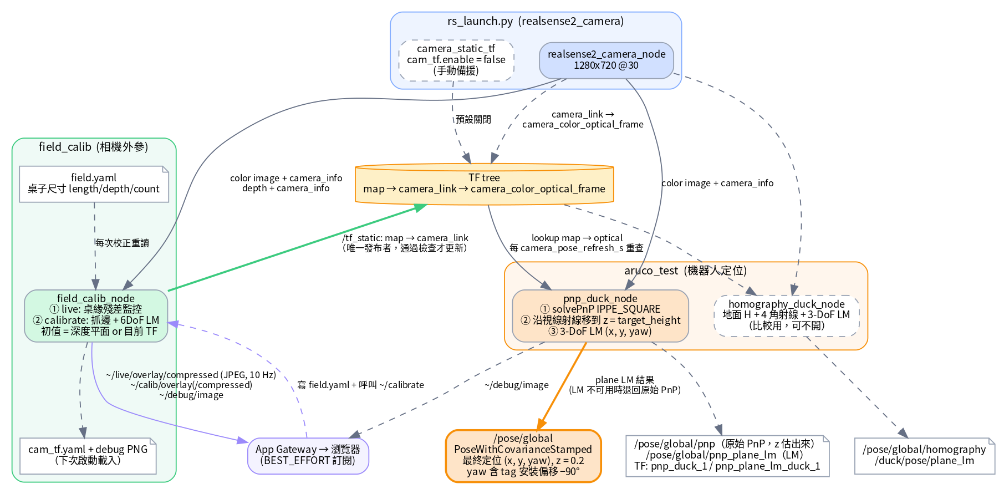
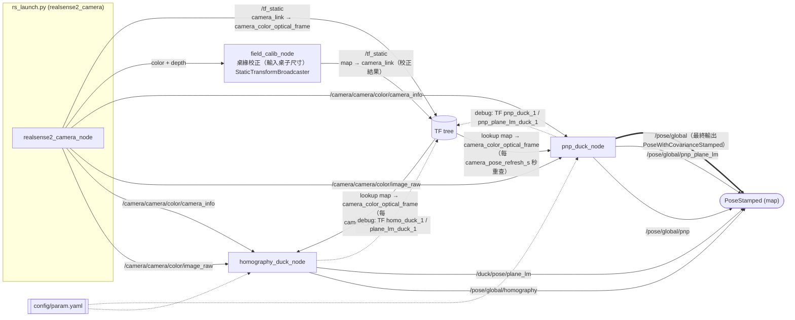
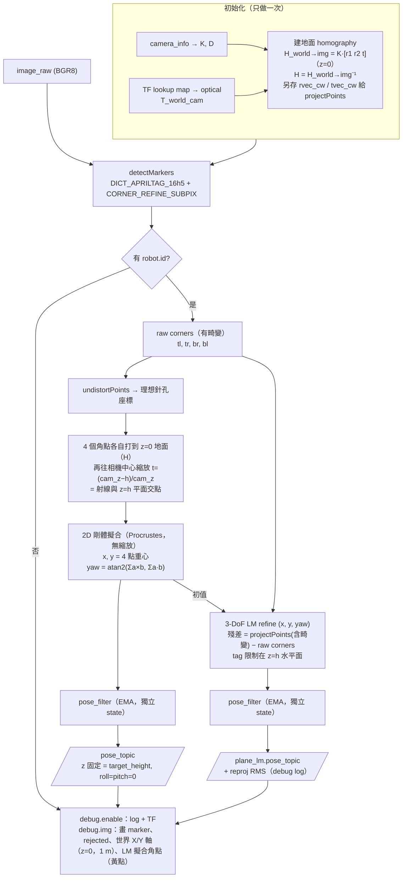
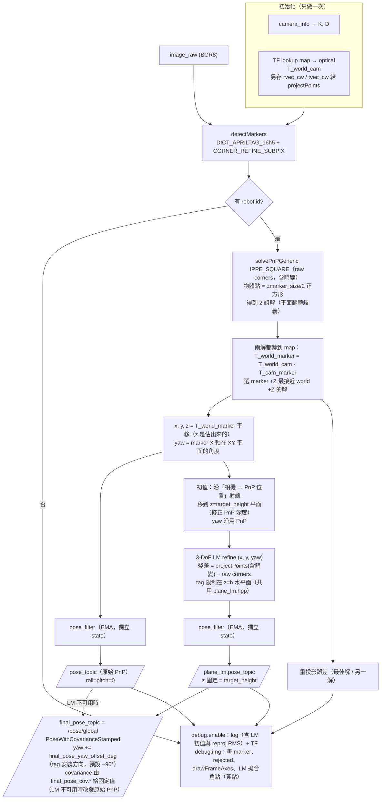
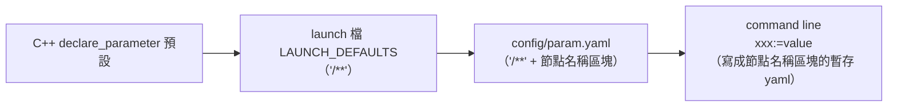
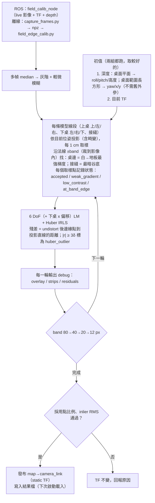

# 定位流程架構

俯瞰相機（RealSense D455）+ 機器人頂部 AprilTag 16h5，兩個定位節點：

| 節點 | 方法 | 輸出 |
|---|---|---|
| `homography_duck_node` | tag 固定在已知高度的水平面上（3 DoF：x, y, yaw）（比較用） | `/pose/global/homography`（閉式解）、`/duck/pose/plane_lm`（LM refine） |
| `pnp_duck_node` | solvePnP 自由 6 DoF，再轉到 map；再以 PnP 為初值做平面約束 LM | **`/pose/global`（最終定位輸出，`PoseWithCovarianceStamped` = LM refine 繞 z 轉 `final_pose_yaw_offset_deg`，LM 不可用時退回原始 PnP）**、`/pose/global/pnp`（原始 PnP）、`/pose/global/pnp_plane_lm`（LM refine） |

---

## 1. 系統總覽

一張圖版本：[docs/localization_flow.png](docs/localization_flow.png)（原始檔 [docs/localization_flow.dot](docs/localization_flow.dot)，重畫：`dot -Tpng -Gdpi=130 docs/localization_flow.dot -o docs/localization_flow.png`）





TF 樹：

```
map ──(field_calib_node 校正結果)──> camera_link ──(RealSense 出廠)──> camera_color_frame ──> camera_color_optical_frame
 └──(debug)──> homo_duck_1 / plane_lm_duck_1 / pnp_duck_1 / pnp_plane_lm_duck_1
```

---

## 2. homography_duck_node



重點：
- **z 永遠等於 `target_height`**，不是估出來的。
- xy 精度直接受 **`target_height` 和相機外參** 影響。h 誤差會沿相機放射方向造成比例誤差；外參角度誤差會造成整體平移（見第 5 節）。
- 閉式解不需要 marker 邊長（正方形重心就是中心）；LM 需要 `robot.marker_size`。

---

## 3. pnp_duck_node



重點：
- 原始 PnP 的 **z 不固定**，是由 tag 在影像中的大小推出的深度，所以強烈依賴 `robot.marker_size` 準確。
- LM 版本和 `homography_duck` 的 plane_lm 用**同一個目標函數**（`include/aruco_test/plane_lm.hpp`），只差初值來源，因此收斂到同一個解（實測差異 < 0.1 mm）。
- 原始 PnP 的 z 可以當**一致性檢查**：若 z 明顯偏離 `target_height`，代表 `marker_size`、`target_height`、相機高度三者至少有一個不對。

---

## 4. 參數來源與優先順序



右邊蓋左邊。`ros2 run` 不經過 launch，只會有 C++ 預設 + `--ros-args -p`。
相機外參不在 param.yaml：由 `field_calib_node` 校正後發布（見第 6 節）。`rs_launch.py` 的 `cam_tf.*` 只剩手動備援（`cam_tf.enable` 預設 false）。

---

## 5. 目前已知的誤差來源（2026-09-19 實測）

### 第一次（`cam_tf.z=1.45`、`marker_size=0.1`）

真值 (0.08, 0.05, 0.2)、yaw 0，靜止 30 幀：

| 方法 | xy 誤差 | yaw 誤差 | 抖動 (xy std) |
|---|---:|---:|---:|
| homo（舊版中心點） | 176 mm | −2.85° | 0.15 mm |
| homo4（目前 `/pose/global/homography`） | 176 mm | −1.80° | 0.08 mm |
| plane_lm | 177 mm | −1.69° | 0.09 mm |
| pnp | 331 mm（z=0.073，應為 0.2） | −1.92° | 2.6–3.7 mm |

所有方法偏同一個方向 → 主要是**相機外參（cam_tf）誤差**，不是定位演算法。

### 第二次（`cam_tf.z=1.3`、`marker_size=0.08`，**機器人不在真值位置**：tag 在影像中比真值位置偏右約 15 px，只能用來比較方法間差異）

同一批影像同時跑兩個節點，各 60 幀：

| 輸出 | x | y | z | yaw |
|---|---:|---:|---:|---:|
| pnp（原始） | 0.0306 | 0.0842 | 0.202 | −2.93° |
| pnp_plane_lm | 0.0291 | 0.0823 | 0.200 | −2.72° |
| homography（homo4） | 0.0291 | 0.0823 | 0.200 | −2.81° |
| homography plane_lm | 0.0291 | 0.0823 | 0.200 | −2.72° |

- 原始 PnP 的 z = 0.202，和 `target_height` 一致 → `marker_size=0.08` 與 `cam_tf.z=1.3` 彼此吻合。
- 兩個 plane_lm 結果相同（同一目標函數），homo4 只差 yaw 0.09°。

### 第三次（`cam_tf.z=1.3`、`marker_size=0.08`，真值 (0.08, 0.05, 0.2)、yaw 0，使用中的 `pnp_duck_node`，60 幀）

| 輸出 | x | y | dx (mm) | dy (mm) | xy 誤差 | yaw 誤差 | 抖動 (x / y std) |
|---|---:|---:|---:|---:|---:|---:|---:|
| `/pose/global/pnp` | 0.0503 | 0.0857 | −29.7 | +35.7 | 46 mm | −0.57° | 2.1 / 2.9 mm |
| `/pose/global/pnp_plane_lm` | 0.0533 | 0.0896 | −26.7 | +39.6 | 48 mm | −1.00° | 0.07 / 0.12 mm |

- 兩個輸出的平均位置差不多，plane_lm 把抖動降了約 25–30 倍。
- 剩下約 5 cm 的偏差兩者一致 → 仍是外參（cam_tf）問題。

---

## 6. 外參標定：桌邊線（`src/field_calib/`、`tools/calib/`）

桌子尺寸由使用者輸入 `src/field_calib/config/field.yaml`（`table.length / depth / count`，每次校正重新讀取）。目前場地：兩張 180×60 cm 白桌。map 原點是離相機較遠的那個合法桌角（圓角延長線交點），z=0 是桌面。
演算法只有一份（`src/field_calib/field_calib/core.py`），ROS 節點與離線 CLI 共用。



### ROS（`field_calib_node`）

```bash
ros2 launch field_calib field_calib.launch.py   # debug 畫面：/field_calib_node/debug/image（看法見 DEBUG.md）
#   給 App 的高頻串流：live.compact:=true live.period:=0.1
#   → ~/live/overlay 換成相機原圖尺寸，並多發 ~/{live,calib}/overlay/compressed（JPEG）
ros2 service call /field_calib_node/calibrate std_srvs/srv/Trigger   # 也可以用 service 觸發
# 其他影像 topic：/field_calib_node/live/overlay、/field_calib_node/calib/{overlay,strips,residuals}
```

- **啟動**：有結果檔就直接發布；沒有就自動校正一次（`calib.on_startup`）。偵測到別的節點也在發布 `map→camera_link` 會 warn。
- **live**（每 `live.period` 秒）：用「目前的 TF」抓邊、算殘差（不優化）。桌緣對不上時會 warn（相機被碰、桌子被推）。
- **calibrate**：收 `calib.frames` 幀 → 完整校正，每一輪 band 都發布到 `~/calib/*`（每輪停 `calib.stage_delay` 秒），PNG 與 `cam_tf.yaml` 存到 `calib.output_dir/<時間>/`。
- 校正通過就重新發布 `map→camera_link` 並寫入結果檔；`pnp_duck` / `homography_duck` 約 1 秒內跟上（`camera_pose_refresh_s`），不用重啟。
- `calib.apply:=false` 為 dry run：只計算，不動 TF 與結果檔。
- `live.compact`：疊圖只畫相機原圖（不含右側面板）並加發 JPEG。完整版 1740×820 每張 4.2 MB，BEST_EFFORT 訂閱者收不到；JPEG 約 106–144 KB，實測 10 Hz 穩定。寫檔的 PNG 仍是完整版。
- 深度平面檢查：用 depth 擬合桌面平面，回報與桌緣解的法向量夾角、相機高度差（只回報，不進優化）。

### 離線

```bash
python3 tools/calib/capture_frames.py --n 30 --out tools/calib/out/cap1.npz     # container
python3 tools/calib/field_edge_calib.py tools/calib/out/cap1.npz [--show] [--disable lower_right]
python3 tools/calib/field_edge_calib.py --selftest   # synthetic image, init off by 3 deg / 10 cm
```

### debug 畫面怎麼看
- **overlay**：半透明色帶＝搜尋範圍；灰線＝本輪前模型、彩線＝本輪後；綠點＝採用，× 顏色＝剔除原因；右側 4 個角落放大、各線段統計。
- **strips**：每條線段沿模型線拉直（橫＝沿線、縱＝法線方向放大 4×，**往下＝往地板**）。點應該落在白→暗交界上。
- **residuals**：殘差 vs 沿線位置。常數偏移＝尺寸/位置、斜率＝旋轉或該邊不直、跳點＝誤抓（遮擋物、桌腳、線材）。

### 2026-09-19 結果

| | x | y | z | roll | pitch | yaw |
|---|---:|---:|---:|---:|---:|---:|
| 手量 | 0.9100 | 1.1800 | 1.3000 | 0.0000 | 1.1780 | −1.5708 |
| 標定（14:40 cap1） | 0.9493 | 1.1759 | 1.2900 | **−0.0335** | 1.1697 | −1.5886 |
| 標定（ROS，15:25） | 0.9491 | 1.1744 | 1.2899 | −0.0348 | 1.1705 | −1.5906 |

- **使用中的 static TF roll 是 +0.03353（正負號錯）**，標定結果是 −0.03353。live 畫面裡模型線對不上桌緣就是這個原因（兩者差 3.8°），不是抓邊問題。
- 4 次擷取在同一個固定位姿下比較，除了 lower_right（人站在旁邊、手壓在桌邊）之外，各邊在影像中的位置差 ≤ 0.4 px。
- cam_tf 數字之間最多差 5 mm / 0.4°，但 x、roll、yaw 會互相抵消；換成「像素 → z=0.2 平面」的對應，整個桌面最大差 3.8 mm（平均 2 mm）。
- 深度平面：法向量與桌緣解差 0.67°，相機高度 depth 1.314 m vs 桌緣 1.291 m（差 1.8%）。D455 深度本身有 1–2% 尺度誤差，**也可能是桌子實際尺寸不是 180×60**（例如 6 ft × 2 ft = 182.9×61 cm 會差 1.6%）→ 需要實際量桌子。
- 桌子尺寸、桌緣圓角造成的偏差不會出現在重複性裡；定位誤差仍需在確認真值的點上量。

### 2026-09-19 下午：輸入尺寸 + 自動初值 + 自動套用

- 合成測試：3 種相機位置、不給舊外參，深度初值偏 0–1°、3–5 cm，校正後 < 0.01°、< 0.3 mm，原點都選對。
- 實機 dry run（相機或桌子在上午校正後已被移動，舊外參 live 只剩 15% 對得上）：
  深度初值與舊 TF 初值收斂到同一個解（差 0.5 mm / 0.014°），採用 87%、inlier RMS 0.84 px（right_1 被人擋住）。
- 深度量到的桌面範圍 1.877 × 1.245 m（輸入 1.8 × 1.2），深度高度 1.315 m vs 桌緣解 1.302 m。
  兩者都約大 1–4%，仍無法分辨是深度尺度誤差還是桌子實際尺寸，需實際量桌子。

### /pose/global 的型別、yaw 偏移與 covariance（2026-09-20）

`final_pose_yaw_offset_deg`（預設 **−90**）是 tag 座標系轉到機器人座標系的繞 z 旋轉，對應 tag 實際貼在機器人上的方向。只影響 `/pose/global` 的 yaw，位置不變；`/pose/global/pnp`、`/pose/global/pnp_plane_lm` 仍是 tag 本身的朝向。

型別是 `geometry_msgs/PoseWithCovarianceStamped`，covariance 是**參數給的固定值**（`final_pose_cov.*`，對角線，row-major x, y, z, roll, pitch, yaw）：

| 參數 | 預設 | 理由 |
|---|---:|---|
| `sigma_xy_m` | 0.005 | 每幀 LM 抖動只有約 0.1 mm，但外參與桌子尺寸誤差是 mm 等級（實測不同次校正之間，平面對應差最多 3.8 mm），所以取保守值 |
| `sigma_z_m` | 0.01 | z 是假設等於 `target_height`，不是量出來的 |
| `sigma_yaw_deg` | 1.0 | |
| `sigma_roll_pitch_deg` | 5.0 | roll/pitch 直接假設為 0（tag 水平） |

不是從影像殘差推算的，所以遮擋或 tag 距離變化不會反映在數值上；要改精度就改參數。
