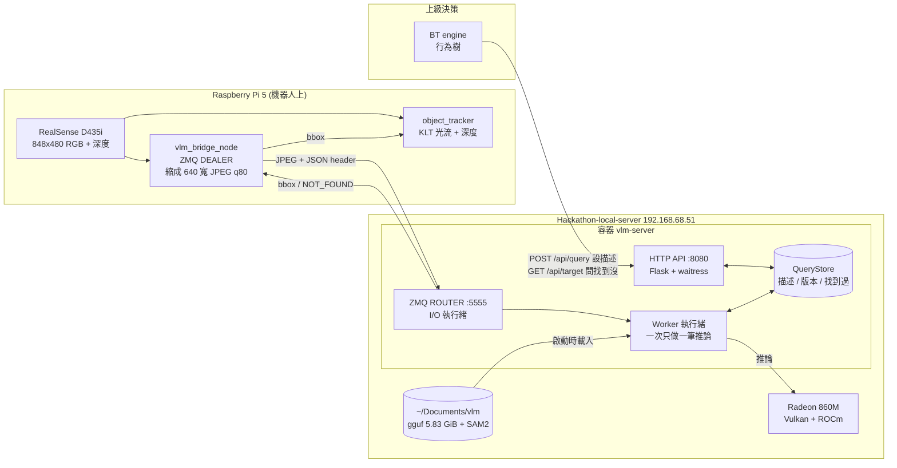
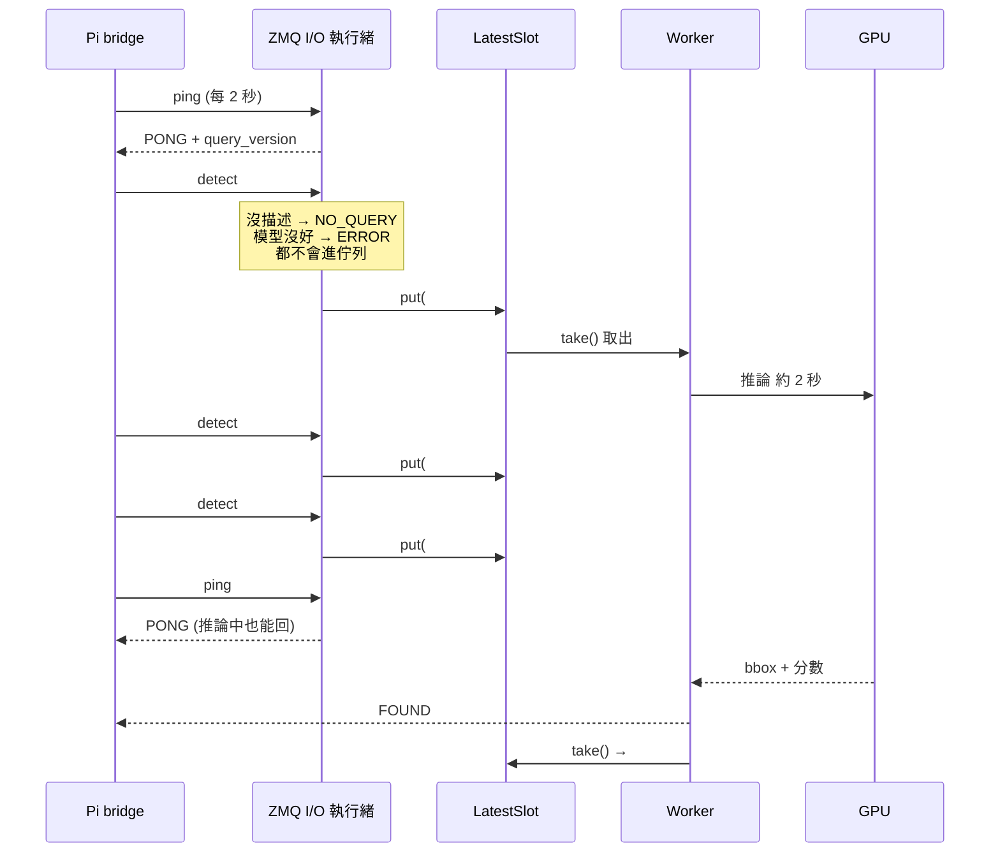
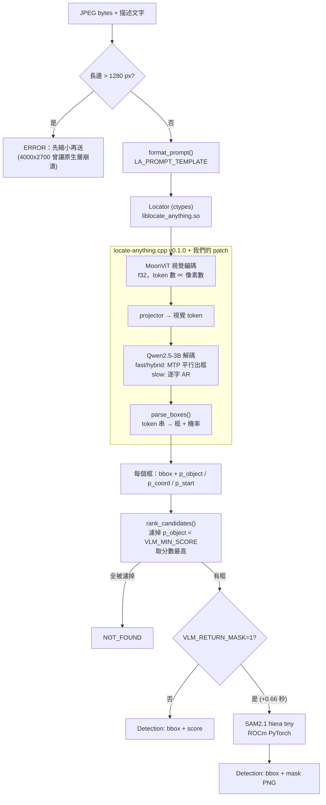
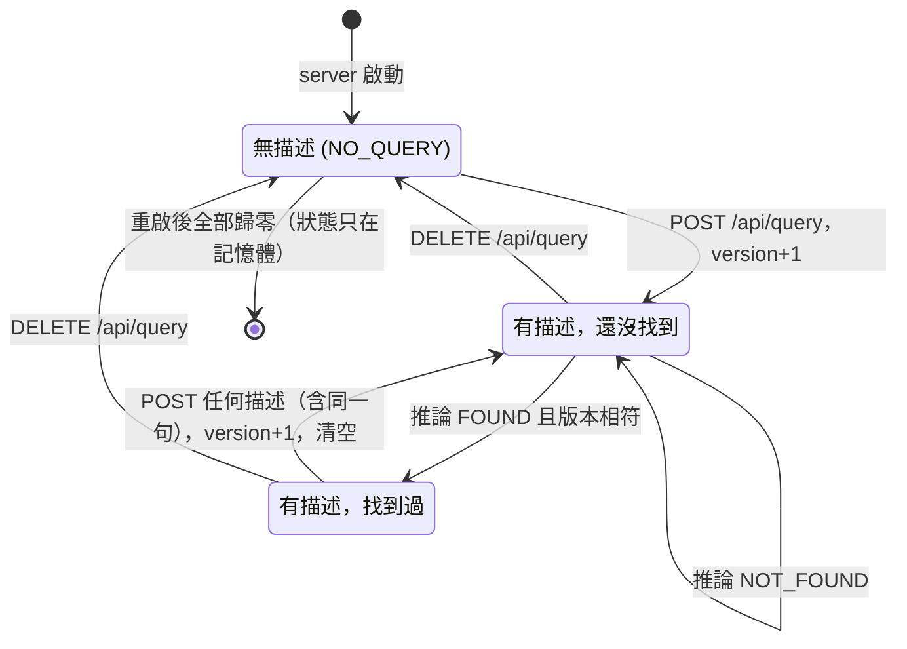
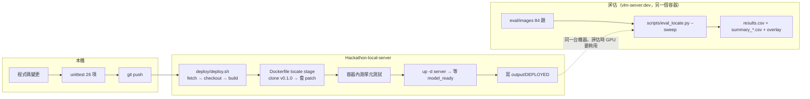
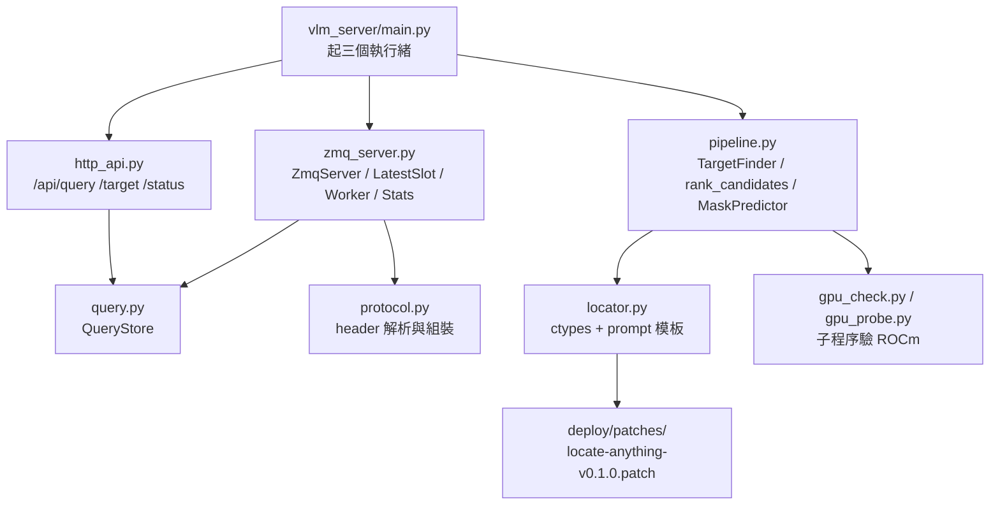

# 架構：VLM 目標偵測 server

> 2026-09-20。協定細節見 [vlm_transport.md](vlm_transport.md)，除錯與部署見 [DEBUG.md](DEBUG.md)，待辦與評估數據見 [TODO.md](TODO.md)。
> 圖是 Mermaid 格式，GitHub、VS Code（Markdown Preview Mermaid Support）都能直接顯示。

## 1. 系統全貌

上級（BT engine）用 HTTP 設定「要找什麼」，Pi 持續送影像，server 回 bbox，下游拿 bbox 做視覺追蹤。

| 介面 | 埠 | 用途 |
|---|---|---|
| ZMQ ROUTER | 5555 | Pi 送影像、收 bbox；也收 ping |
| HTTP | 8080 | 設定描述、查詢是否找到、查狀態 |

## 2. 一次請求的流程

同一時間只跑一筆推論。推論進行中又收到新的圖時，**每個 client 只留最新的那一筆**，舊的直接丟掉不回覆；client 逾時後會自己重送。ping、沒有描述、模型還沒好這三種情況由 I/O 執行緒立刻回覆，不用排隊。

## 3. 推論內部

**時間**（640×362、`fast`、Radeon 860M）：視覺編碼加解碼約 1.9～2.1 秒，和像素數大致成正比。降解析度會變快，但誤抓變多，所以維持 640 寬（[TODO.md](TODO.md) §5）。

**分數**（我們 patch 加的，[TODO.md](TODO.md) §3）：

| 分數 | 意義 | 有沒有用 |
|---|---|---|
| `p_object` | 1 − P(`<none>`)，模型在「框出來」和「說沒有」之間的取捨 | **有**，正確和誤抓分得開 |
| `p_coord` | 4 個座標 token 機率的平均 | 沒有，0.16～0.50 混在一起 |
| `p_start` | `<box>` token 的機率 | 沒有，一律約 1.0 |

## 4. 描述與「找到過」的狀態

`QueryStore` 用同一把鎖保護描述、版本、是否找到過。**每次 POST 都算新任務**：版本加一、清空找到過的狀態。推論開始時記下版本，結果回來時只有版本沒變才會標記成功，所以換了描述之後，舊描述晚回來的結果不會算進去。

`GET /api/target` 回 `{"text": ..., "query_version": N, "found": true|false}`。BT engine 可以比對 `query_version`，確認拿到的答案對應的是哪一個描述。

## 5. 部署與評估

部署一律走 git；評估另外開容器跑，不動正式服務。

- 測試沒過或 build 失敗時 `deploy.sh` 會中止，服務繼續跑舊版本。
- 調整 prompt 模板或門檻只要改 `.env` 再 `docker compose up -d server`，不用重新 build。
- `LA_PATCH=0` 可以 build 回沒有 patch 的原版做對照。

## 6. 程式碼地圖

| 檔案 | 責任 |
|---|---|
| `vlm_server/main.py` | 進入點；I/O、推論、HTTP 三個執行緒 |
| `vlm_server/zmq_server.py` | ROUTER 迴圈、只留最新一筆、單一 worker、統計 |
| `vlm_server/query.py` | 描述、版本、是否找到過 |
| `vlm_server/pipeline.py` | 輸入尺寸保護、分數過濾、SAM2 mask |
| `vlm_server/locator.py` | prompt 模板、ctypes 包裝、讀分數 |
| `scripts/eval_locate.py` | 評估：掃描設定、標註草稿、門檻取捨表 |
| `tools/test_client.py`、`tools/mock_server.py` | 不靠 Pi 或不靠 GPU 的測試工具 |
| `tools/grab_frame.py` | 在機器人端抓影像，建立評估集 |
